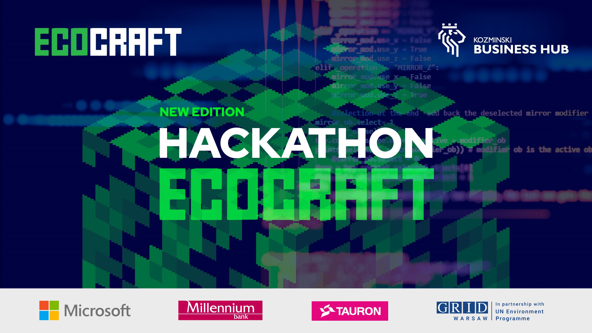

# plugins
Plugins developed during the Ecocraft Hackathon 2022

# Giga Block Incorporated
## Pollution and heat
https://github.com/Ecocraft-2022/GigaBlockIncorporated

# Verde Craft
## Temperature, fuel and waste
https://github.com/adbreeker/VerdeCraft

# EcoMak
## Ecological survival mode
https://github.com/miko-mak/EcoPlugin
